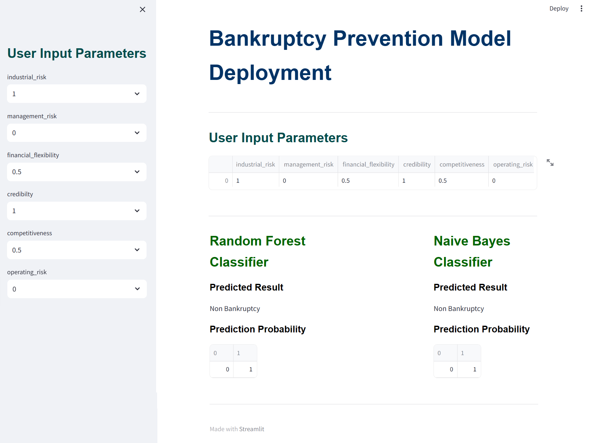

# Bankruptcy Prevention

This project involves predicting a binary outcome (whether a business will go `bankrupt` or `non-bankrupt`) based on various features. The aim here is to model the probability of a business going bankrupt from different factors. 


## Model used to predict probabilities

* Logistic Regression
* KNN model
* Naïve Bayes
* Decision Tree
* Random Forest

## Bankruptcy Prevention Model Deployment

### Install dependencies

```sh
$ pip install -r requirements.txt
```

### Run Stremlit
```sh
$ streamlit run streamlit-bankruptcy-prevention.py
```

Access it using `http://localhost:8501/`

### Outcome



### Conclusion

As per data analysis, I conclude that there are 3 important features from data that contributes most to the prediction they are -
* financial_flexibility
* credibility
* compitiveness
